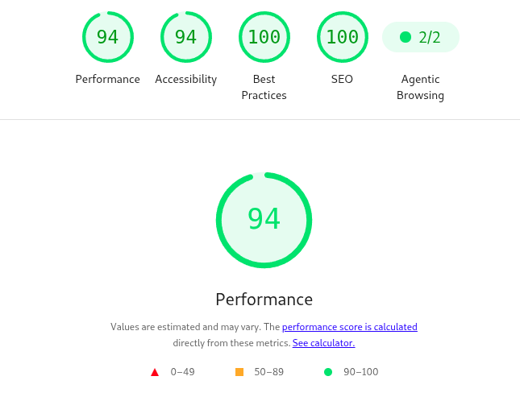
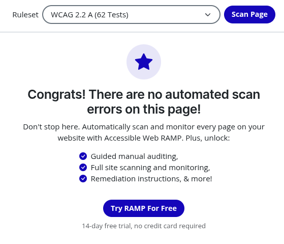

# 🌍 Landing Page hDC Agency

hDC Agency é um projeto de landing page responsiva desenvolvida como parte de um estudo de Bootstrap.

O objetivo foi criar uma experiência imersiva e tecnológica para promover uma agencia de desenvolvimento digital fictícia.

## Demo

Acesse: https://one-page-sepia.vercel.app

## 💻 Tecnologias Utilizadas

* HTML5

* CSS3 / Bootstrap

* JavaScript

* Design responsivo

* Animações CSS

* Parallax

* ProgressBar

## ⚡ Performance e Acessibilidade

O projeto foi otimizado para alcançar excelentes métricas de desempenho e acessibilidade utilizando boas práticas de design e desenvolvimento web.

### Lighthouse

### Accessible Web

## 👩‍💻 Sobre a Designer

Desenvolvido por mim — UI/UX Designer & Front-end Developer.
Apaixonada por criar experiências digitais que unem estética, propósito e funcionalidade.

**📫 Entre em contato:**

[LinkedIn](https://www.linkedin.com/in/la%C3%ADs-reis/) | [Behance](https://www.behance.net/laisreis2)